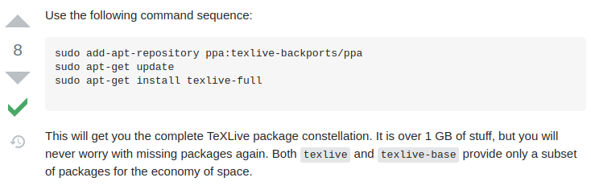

# NOTE_LaTeX
## 第一次學 LaTeX，想說做點紀錄方便以後回來看，然後學一下 git 的使用方式
### 參考教學
- [LaTex Tutorial for Beginners Full Course (主要是這個)](https://www.youtube.com/watch?v=fCzF5gDy60g)
- [LaTeX Tutorials (featuring Texmaker)（這個講得比較細我比較沒看）](https://www.youtube.com/watch?v=0ivLZh9xK1Q&list=PL1D4EAB31D3EBC449)

### 日誌
- Day1：學習一些基本的符號及字體大小，vscode 設定 git 失敗 Da2 再來試試
- Day2：學了表格跟跟陣列（矩陣）的寫法，然後 vscode 上 git push 還是失敗（應該是我用錯 QQ），在我搞定之前應該會都用終端機上傳
- Day3：今天是學一些寫微積分時會用的符號，諸如微分符號，積分符號，向量等，到在學的時候遇到了

    ```
    LaTeX Error: File `esvect.sty' not found
    ```
    缺套件的問題，上網查了一下解決方法

    
    
    我自己是裝 textlive-base（想說沒有要學很深結果馬上就踩坑ww）雖然 3 GB的確挺多的，不過之後應該不太會再遇到缺套件的問題了
- Day4：數學符號與定義，~~越學越佩服那些數學家怎麼記得住XD~~
- Day5：今天學的東西比較多是在設定檔案的環境以及如何進行客製化，所以註解寫的比程式碼還多XD